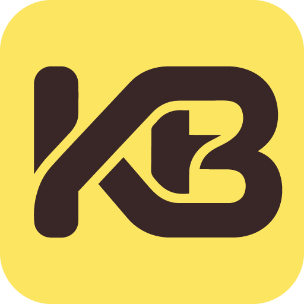
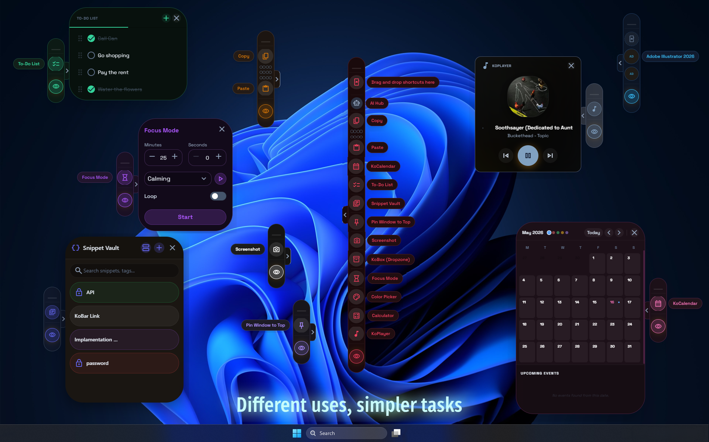
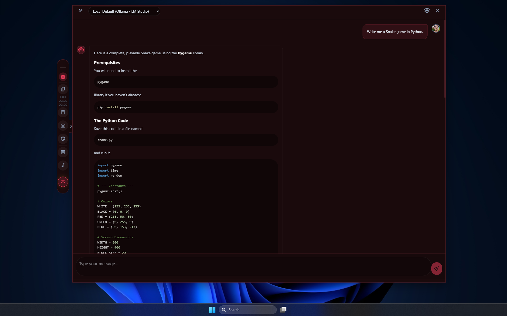
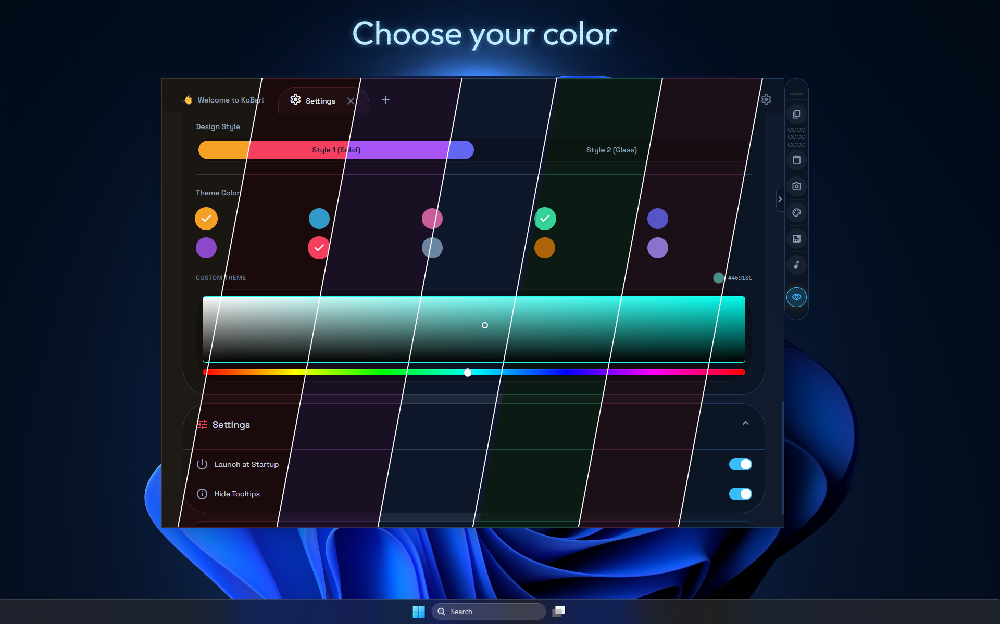

<p align="center">
  
</p>

<h1 align="center">KoBar</h1>

<p align="center">
  <strong>Your modular, always-on-top desktop utility sidebar.</strong><br/>
  A multi-threaded creative assistant that lives on the edge of your screen.
</p>

<p align="center">
  <a href="https://apps.microsoft.com/store/detail/9P2KPFF3G9L9?cid=DevShareMCLPCS"></a>
  
  
  
</p>

> 🍎 **macOS support is currently under active development.** Some features may be limited or unavailable on macOS.

---

## 📖 What is KoBar?

**KoBar** is a frameless, transparent, always-on-top desktop sidebar built with **Electron** and **React**. It docks to either edge of your screen and provides instant access to a rich set of productivity tools, all without leaving your current workflow.

Visit our website: [KoBar.org](https://kobar.org/)

Think of it as a Swiss Army knife that floats on your desktop. With its new **plugin-based architecture**, you can customize KoBar with exactly the tools you need—clipboard managers, AI assistants, screenshot studios, media controllers, and more—all in one sleek, customizable sidebar.

<p align="center">
  <a href="https://www.youtube.com/watch?v=KfZmoITxg2E">
    
  </a>
</p>

<p align="center">
  <sub>💡 Click or tap the image above to watch the KoBar trailer on YouTube!</sub>
</p>

---

## ✨ Core Features & The Plugin Ecosystem

KoBar has evolved into a powerful **Plugin-Based Architecture**. Instead of a monolithic application, KoBar provides a lightweight, modular core, giving you complete freedom to install only the tools you need or even build your own!

### 🔲 Modular Core (Built-in)
- **Always-on-top** transparent overlay — never leaves your sight.
- **Edge docking** — snaps to the left or right screen edge with drag-and-drop repositioning.
- **Mini Mode** — collapses into a small floating eye icon to save space.
- **Free-floating mode** — drag the sidebar anywhere on the screen, across multiple monitors.
- **Multi-monitor support** — seamless edge detection and snapping across all connected displays.

### 🧩 Official Plugins
Extend KoBar by installing plugins from the community or the core team. Here is the growing list of official plugins maintained by the KoBar Project:

- 🤖 **[AI Hub](https://github.com/Kobar-Project/AI-Hub-plugin)**: Multi-provider AI assistant supporting OpenAI, Gemini, Claude, and local LLMs.
- 📋 **[Clipboard Manager](https://github.com/Kobar-Project/Clipboard-Manager-plugin)**: Multi-slot sequential clipboard (FIFO queue) with image support.
- 📝 **[Snippet Vault (Notes)](https://github.com/Kobar-Project/SnippetVault-plugin)**: Save and organize text templates, code snippets, and AI prompts.
- 📸 **[Screenshot Studio](https://github.com/Kobar-Project/Screenshot-plugin)**: Region & full-screen capture with a built-in annotation editor.
- 🎵 **[KoPlayer](https://github.com/Kobar-Project/KoPlayer-plugin)**: System media controller (Spotify, YouTube, etc.) with album art.
- 📅 **[KoCalendar](https://github.com/Kobar-Project/KoCalendar-plugin)**: Google Calendar integration and event alerts.
- ⏱️ **[Focus Mode](https://github.com/Kobar-Project/Focus-Mode-plugin)**: Customizable timer with ambient melodies.
- 🔢 **[Calculator](https://github.com/Kobar-Project/Calculator-plugin)**: Floating scientific calculator with history.
- 🎨 **[Color Picker](https://github.com/Kobar-Project/Color-Picker-plugin)**: Pick colors anywhere on your screen with HEX/RGB/HSL values.
- 📦 **[KoBox](https://github.com/Kobar-Project/KoBox-plugin)**: Drag-and-drop file staging area with auto-cleanup.
- 📌 **[PinWindowToTop](https://github.com/Kobar-Project/PinWindowToTop-plugin)**: Pin any third-party window to "Always on Top".
- 🚀 **[Shortcuts](https://github.com/Kobar-Project/Shortcuts-plugin)**: Quick app launcher and shortcut manager.
- ✅ **[ToDo List](https://github.com/Kobar-Project/ToDoList-plugin)**: Minimal, draggable task list with priority ordering.

---

## 🧩 KoBar Plugins Registry

Welcome to the official Plugin Registry for [KoBar](https://github.com/Kobar-Project/KoBar)! 

This repository serves as the central database for all community-created plugins available in the KoBar marketplace. The registry is fully automated and powered by GitHub Actions.

### ⚙️ How It Works

1. **Source of Truth:** Developers submit their GitHub repository names to the `plugins.json` file in this repository.
2. **Automated Bot:** A GitHub Action runs automatically every midnight (or when a new PR is merged).
3. **Data Fetching:** The bot visits every registered repository, reads their `kobar.json` metadata file, and fetches the latest version and release notes from the GitHub Releases API.
4. **Registry Generation:** The bot compiles all this data and generates a single `registry.json` file.
5. **Client App:** The KoBar desktop application downloads this lightweight `registry.json` file to instantly display the most up-to-date plugins to users without hitting API rate limits.

### 🚀 How to Submit Your Plugin

If you have developed a plugin for KoBar and want it to appear in the official Plugin Store, follow these simple steps:

#### Step 1: Add a Manifest to Your Repository
Ensure your plugin's repository has a `kobar.json` (or `manifest.json`) file in its root directory. This file provides the store with your plugin's display information.

**Example `kobar.json`:**
```json
{
  "id": "my-awesome-plugin",
  "name": "Awesome Plugin",
  "description": "This plugin does amazing things for KoBar.",
  "version": "1.0.0",
  "versionNote": "Updated plugin images.",
  "author": "YourName",
  "entry": "index.js",
  "isBeta": false,
  "githubRepo": "your-name/your-plugin",
  "icon": "library_books",
  "image": "https://raw.githubusercontent.com/YourName/your-repo/main/banner.png",
  "storeImage": [
    "https://raw.githubusercontent.com/YourName/your-repo/main/banner.png1",
    "https://raw.githubusercontent.com/YourName/your-repo/main/banner.png2",
    "https://raw.githubusercontent.com/YourName/your-repo/main/banner.png3"
  ],
  "categories": ["Utility", "Productivity"],
  "languages": ["en", "tr", "de"]
}
```
*(Note: You do not need to specify the `version` here. The bot automatically fetches the version number and release notes from your latest GitHub Release!)*

#### Step 2: Create a GitHub Release
Make sure you have created at least one **Release** on your GitHub repository (e.g., `v1.0.0`) and attached your plugin's `.zip` file to it.

#### Step 3: Fork and Update `plugins.json`
1. Fork the [kobar-plugins-registry](https://github.com/Kobar-Project/kobar-plugins-registry) repository.
2. Open the `plugins.json` file.
3. Add your repository path (`Username/RepositoryName`) to the array.

#### Step 4: Open a Pull Request
Submit a Pull Request (PR) to the registry repository. Once the KoBar team reviews and merges your PR, the bot will automatically index your plugin, and it will appear in the KoBar app within a few minutes!

---

## 🪄 Vibe Coding: Build Plugins with AI

You don't need to be an expert developer to build a KoBar plugin. KoBar officially supports **Vibe Coding**!

Inside the `for-agents` directory of this repository, you will find specialized **Agent Skills** (e.g., `kobar-plugin-developer/SKILL.md`). These files contain all the architectural rules, API constraints, and UI guidelines needed to build a plugin.

**How to vibe code a plugin:**
1. Open the KoBar project in an AI-powered IDE (like Cursor, Windsurf) or use an agentic coding assistant (like Cline, Roo, or Antigravity).
2. Tell the AI: *"I want to create a new KoBar plugin that does [YOUR IDEA]. Please read the `for-agents/kobar-plugin-developer/SKILL.md` file first to learn the rules."*
3. The AI will read the guidelines and automatically write the code for you inside the local `pluginsPlayground` folder.
4. Open the KoBar app, and your new plugin will be running instantly for testing!

<p align="center">
  
</p>

---

## 🎨 Theming & Design

KoBar ships with **11 built-in themes**, a **custom theme generator**, and a built-in **Color Picker** that lets you choose any color to create your own personalized theme on the fly:

| Theme | Color |
|-------|-------|
| Ember *(default)* | 🟠 Warm Amber |
| Ocean | 🔵 Deep Blue |
| Sakura | 🌸 Cherry Blossom |
| Emerald | 🟢 Forest Green |
| Midnight | 🔮 Deep Indigo |
| Amethyst | 💜 Rich Purple |
| Crimson | 🔴 Vibrant Red |
| Nord | 🧊 Arctic Blue-Grey |
| Coffee | ☕ Warm Brown |
| Lavender | 💟 Pastel Purple |
| Custom | 🎨 Pick any color with the built-in Color Picker |

**Design Modes:**
- **Style 1 (Solid)** - opaque dark background
- **Style 2 (Glass)** - frosted glassmorphism with adjustable opacity

<p align="center">
  
</p>

---

## 🌍 Internationalization

Fully translated into **10 languages:**

🇺🇸 English · 🇹🇷 Turkish · 🇩🇪 German · 🇫🇷 French · 🇪🇸 Spanish · 🇷🇺 Russian · 🇯🇵 Japanese · 🇨🇳 Chinese · 🇸🇦 Arabic · 🇮🇳 Hindi

---

## 🏗 Architecture

```
KoBar/
├── electron/               # Electron Main Process
│   ├── main.cts            # Window management, IPC handlers, OS integrations
│   ├── preload.cts         # Context bridge (IPC API exposed to renderer)
│   ├── smtc-worker.cts     # Windows SMTC media monitoring (Worker Thread)
│   └── licenseManager.cts  # Hardware ID & license validation
├── src/                    # React Frontend (Renderer Process)
│   ├── App.tsx             # Root component & layout orchestration
│   ├── components/
│   │   ├── core/           # Sidebar layout, Window Controls
│   │   ├── plugins/        # Plugin Manager UI and rendering engine
│   │   └── license/        # LicenseActivationModal
│   ├── store/              # Zustand state management
│   │   ├── useAppStore.ts          # Main application state (~58KB)
│   │   └── usePluginStore.ts       # Plugin registry and management state
│   ├── hooks/              # Custom React hooks
│   │   ├── useSpeechToText.ts      # Web Speech API integration
│   │   └── useUnifiedResize.ts     # Cross-platform panel resizing
│   ├── i18n/               # Translations (10 languages)
│   ├── types/              # TypeScript definitions (global.d.ts)
│   └── config/             # Default state & clipboard configs
├── Assets/                 # Static resources
│   ├── Melody/             # Focus mode ambient audio files
│   ├── DefaultNote/        # Default note templates
│   └── microsoftStore/     # Store listing assets (10 languages)
└── build/                  # App icons & build resources
```

### Key Architectural Decisions

- **Ghost Window Pattern** — KoBar uses a large transparent window (6000×4000px on Windows) to enable free-floating positioning while maintaining always-on-top behavior. Mouse events are dynamically forwarded or ignored based on hover detection.
- **Strict Context Isolation** — `nodeIntegration: false`, `contextIsolation: true`. All IPC is bridged through a typed `window.api` interface via the preload script.
- **Cross-Platform** — `process.platform` checks (`darwin` / `win32`) are used throughout for OS-specific behavior (NSPanel vs toolbar window type, PowerShell vs AppleScript, SMTC vs generic media).
- **Zustand State** — All global state is managed by Zustand stores. No Redux. `useState` is reserved for purely local UI toggles.

---

## 🛠 Tech Stack

| Layer | Technology |
|-------|-----------|
| **Runtime** | [Electron 40](https://www.electronjs.org/) |
| **Frontend** | [React 19](https://react.dev/) + [TypeScript 5.9](https://www.typescriptlang.org/) |
| **Bundler** | [Vite 7](https://vite.dev/) |
| **Styling** | [Tailwind CSS 4](https://tailwindcss.com/) |
| **State** | [Zustand 5](https://zustand.docs.pmnd.rs/) |
| **Rich Text** | [Tiptap 3](https://tiptap.dev/) (ProseMirror) |
| **Canvas** | [Konva.js](https://konvajs.org/) + [react-konva](https://konvajs.org/docs/react/) |
| **AI Markdown** | [react-markdown](https://github.com/remarkjs/react-markdown) + [remark-gfm](https://github.com/remarkjs/remark-gfm) |
| **Persistence** | [electron-store](https://github.com/sindresorhus/electron-store) |
| **Distribution** | [electron-builder](https://www.electron.build/) (AppX, EXE) |

---

## 🚀 Getting Started

### Prerequisites

- **Node.js** ≥ 18
- **npm** ≥ 9
- **Windows 10/11**

### Installation

```bash
# Clone the repository
git clone https://github.com/eedali/KoBar.git
cd KoBar

# Install dependencies
npm install
```

### Development

```bash
# Start in development mode (Vite + Electron concurrently)
npm run dev
```

This will:
1. Start the Vite dev server on `http://localhost:5173`
2. Watch and compile Electron TypeScript files
3. Launch the Electron app once all services are ready

### Building

```bash
# Compile TypeScript & bundle for production
npm run build

# Package distributable (AppX for Microsoft Store, EXE for Standalone)
npm run kobar-build
```

---

---

## 🔒 Security

KoBar follows strict Electron security practices:

- ✅ `nodeIntegration: false`
- ✅ `contextIsolation: true`
- ✅ No `@electron/remote`
- ✅ Typed IPC bridge — only specific functions exposed to renderer
- ✅ All frontend–backend communication validated through `ipcMain.handle`
- ✅ No direct Node.js imports in React components

---

## 📦 Distribution

| Platform | Format | Link / Store |
|----------|--------|--------------|
| Windows | AppX | [Microsoft Store](https://apps.microsoft.com/store/detail/9P2KPFF3G9L9?cid=DevShareMCLPCS) |
| Windows (Standalone) | EXE | [GitHub Releases](https://github.com/Kobar-Project/KoBar/releases) |
| macOS | DMG / ZIP | [GitHub Releases](https://github.com/Kobar-Project/KoBar/releases) |

---

## 🤝 Contributing

Contributions are welcome! Please feel free to submit a Pull Request. For major changes, please open an issue first to discuss what you would like to change.

1. Fork the repository
2. Create your feature branch (`git checkout -b feature/amazing-feature`)
3. Commit your changes (`git commit -m 'Add amazing feature'`)
4. Push to the branch (`git push origin feature/amazing-feature`)
5. Open a Pull Request

---

## 📄 License

This project is licensed under the **MIT License** — see the [LICENSE.md](LICENSE.md) file for details.

---

## 🙏 Credits

**Created by [Ekrem EDALI](https://www.linkedin.com/in/ekrem-edali/)**

**Contributors:**
* [arindam-sahoo](https://github.com/arindam-sahoo)

Special thanks to: **Tolunay PARLAK** & **MJ**.

---

## ✉️ Contact

For support or inquiries, you can contact us at [hello@kobar.org](mailto:hello@kobar.org).

[KoBar.org](https://kobar.org)

---

## 💛 Sponsors & Backers

If you find KoBar useful and want to support its ongoing development, consider backing the project through any of the platforms below:

<p align="center">
  <a href="https://www.patreon.com/kobarproject" target="_blank">
    
  </a>
  <a href="https://opencollective.com/kobar" target="_blank">
    
  </a>
</p>
